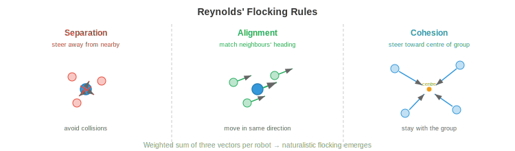

# Space and Extreme Robotics

*Space and extreme environment robotics push autonomy to its limits, where communication delays, radiation, and unstructured terrain demand robots that think for themselves. This file covers planetary rovers, orbital servicing, communication-constrained autonomy, radiation-hardened computing, underwater robotics, search-and-rescue, swarm robotics, and human-robot interaction -- the frontier where AI meets the most hostile environments on (and off) Earth.*

- Throughout this chapter, we have studied autonomous systems that operate in relatively benign environments: roads with lane markings, warehouses with flat floors, kitchens with known object categories. But some of the most impactful applications of robotics are in environments where humans cannot go, or where the cost of human presence is extreme: the surface of Mars, the deep ocean floor, nuclear disaster sites, and burning buildings.

- These **extreme environments** share common challenges: communication is limited or delayed, the terrain is unstructured and unpredictable, hardware must survive harsh conditions, and there is no human nearby to fix things when they go wrong. The robot must be truly autonomous, not just "autonomous with a human watching a screen."

## Space Robotics

- Space is the ultimate extreme environment. There is no air, temperatures swing from -170°C to +120°C, radiation bombards electronics, and help is millions of kilometres away. Space robots must be extraordinarily reliable, energy-efficient, and autonomous.

- **Planetary rovers** are mobile robots that explore the surfaces of other worlds. NASA's Mars rovers (Spirit, Opportunity, Curiosity, Perseverance) are the most famous examples. Each generation has been more autonomous than the last.


- The fundamental constraint is the **communication delay**. Mars is 4-24 minutes away by radio (depending on orbital positions), so round-trip communication takes 8-48 minutes. A rover cannot be joysticked in real time. If it encounters a rock, it cannot ask Earth for help and wait for a response. It must decide for itself.

- Early rovers (Spirit, Opportunity) relied heavily on ground-in-the-loop planning: humans would study images, plan a path, upload commands, and the rover would execute them. A single drive cycle took an entire Martian day (sol). The rover could traverse maybe 50-100 metres per sol.

- **AutoNav** (Autonomous Navigation) on Curiosity and Perseverance dramatically increased autonomy. The rover uses stereo cameras to build a local 3D map (recall stereo depth from chapter 8), evaluates terrain traversability (slope, roughness, rock size), and plans a safe path using a grid-based planner with a traversability cost map. The rover drives autonomously while the human team sleeps, increasing daily traverse distance to 100+ metres.

- The perception pipeline on Mars rovers is constrained by radiation-hardened processors that are orders of magnitude slower than consumer hardware (discussed below). Algorithms must be computationally frugal: classical stereo matching rather than deep neural networks, simple cost-map planners rather than learned policies.

- **Orbital servicing** involves robots that inspect, repair, refuel, or deorbit satellites in orbit. This is a growing field as space becomes more congested. Missions like **OSAM-1** (NASA) and commercial ventures (Astroscale, Northrop Grumman MEV) use robotic arms and docking mechanisms to service satellites.

- The challenge is **proximity operations**: a servicing spacecraft must approach a target satellite (which may be tumbling, uncooperative, and lacking docking interfaces) and perform precise manipulation in microgravity. Vision-based pose estimation (determining the target's 3D position and orientation from camera images) is critical. This uses techniques from chapter 8: feature detection, PnP (Perspective-n-Point) solving, and more recently, deep learning-based pose estimators.

- **Satellite inspection** uses small spacecraft to visually examine other satellites for damage or anomalies. The inspector must autonomously navigate around the target, avoid collision, and capture high-resolution imagery from optimal viewpoints. This is a planning problem: find the trajectory that covers all inspection points while respecting fuel constraints, lighting conditions, and collision avoidance.

## Communication Constraints

- In space, communication is limited by the speed of light, available bandwidth, and orbital geometry (a rover on the far side of Mars cannot communicate with Earth at all without relay satellites).

- These constraints fundamentally change the autonomy architecture. On Earth, a robot can stream HD video to a cloud server, run inference on a GPU cluster, and receive commands in milliseconds. In space, the robot must do everything onboard.

- **High latency** means the robot must plan and act without real-time human guidance. The autonomy software must handle nominal operations, detect anomalies, and respond to hazards without waiting for human input. This requires robust onboard state estimation, fault detection, and contingency planning.

- **Limited bandwidth** means the robot cannot transmit raw sensor data. A single high-resolution image might be several megabytes, but the Mars-to-Earth data rate is only a few kilobits per second through direct-to-Earth links (higher through orbital relays, but still limited). The robot must compress data aggressively, prioritise which data to send, and make most decisions locally.

- **Communication windows** are intermittent. A Mars rover can communicate with Earth only during specific orbital geometries, typically a few hours per sol via relay satellites. Outside these windows, the rover is entirely on its own.

- The implication for AI is that **onboard autonomy** must be highly reliable. The system needs to detect if something is wrong (a wheel is stuck, a sensor has failed, the terrain ahead is impassable), decide on a safe response, and continue operating until the next communication window when it can report back and receive updated instructions.

## Radiation-Hardened Computing

- Space is flooded with ionising radiation: cosmic rays, solar particle events, and trapped radiation in planetary magnetic fields. High-energy particles can flip bits in memory (**single-event upsets, SEUs**), permanently damage transistors (**total ionising dose, TID**), or cause destructive latch-up in circuits.

- **Radiation-hardened (rad-hard)** processors are designed to withstand this environment. They use larger transistor geometries, redundant logic (triple modular redundancy: three copies of each circuit vote on the output), and specialised manufacturing processes. The cost is performance: a state-of-the-art rad-hard processor might deliver 200 MIPS, compared to billions of operations per second on a consumer GPU.

- The **RAD750** (BAE Systems) powered Curiosity and many other spacecraft. It runs at 200 MHz with about 400 MIPS of processing power, comparable to a mid-1990s desktop computer. Perseverance uses a similar class of processor. Running a modern neural network (millions of parameters, billions of multiply-accumulate operations) is infeasible on such hardware.

- **Model compression** becomes essential. Techniques from chapter 6 (quantisation, pruning, knowledge distillation) are used to shrink neural networks to fit within the extreme computational budget. A model that runs in milliseconds on a laptop GPU might need minutes on a rad-hard processor, or might not fit in memory at all.

- An alternative approach uses **commercial off-the-shelf (COTS)** processors with radiation mitigation in software: error-correcting codes, watchdog timers, periodic memory scrubbing, and graceful degradation strategies. Some modern missions use this approach to access more powerful compute at the cost of increased software complexity and risk.

- Future planetary missions are exploring **FPGAs** and specialised AI accelerators that can be radiation-tolerant while providing significantly more compute than traditional rad-hard CPUs, potentially enabling onboard deep learning for the first time.

## Autonomous Navigation in Unstructured Terrain

- On Earth, roads are flat, well-marked, and mapped. On Mars, the Moon, or a disaster site, there are no roads. The terrain is unstructured: rocks, slopes, sand, crevasses, and surfaces that may not support the robot's weight.

- **Terrain classification** evaluates whether each patch of ground is safe to traverse. Features include slope (from 3D reconstruction), roughness (variance of surface normals), rock density, and soil type. Classical approaches compute these features from stereo depth maps; modern approaches use learned classifiers on visual and geometric features.

- **Visual-inertial odometry (VIO)** estimates the robot's motion by tracking visual features across camera frames and fusing with IMU measurements. This is a core SLAM component (chapter 8) adapted for extreme conditions. On Mars, VIO must handle: featureless sandy terrain (few visual features to track), harsh lighting (extreme shadows), and limited compute.

- The estimation fuses visual and inertial data using an **Extended Kalman Filter (EKF)** or factor graph optimisation. The state vector includes position, velocity, orientation, and IMU biases. The prediction step uses IMU integration:

$$\mathbf{x}_{t+1} = f(\mathbf{x}_t, \mathbf{u}_t)$$

- where $\mathbf{u}_t$ is the IMU measurement (acceleration and angular velocity). The update step corrects the prediction using visual feature observations. This is Bayesian estimation (chapter 5): the IMU provides a prior, and visual observations update the belief.

- **Hazard avoidance** is critical during planetary landing. As a spacecraft descends towards the surface, it must identify safe landing zones in real-time using onboard cameras or LiDAR. NASA's **Terrain Relative Navigation (TRN)** system on Perseverance compared onboard camera images to pre-loaded orbital maps to determine its position during descent, then steered away from hazardous terrain. This enabled landing in Jezero Crater, a scientifically rich but terrain-hazardous site that would have been too risky for previous missions.

## Underwater Robotics

- The deep ocean is as alien as space: crushing pressure (1000+ atmospheres at full ocean depth), near-zero visibility, no GPS, and limited communication. Underwater robots are essential for ocean science, offshore infrastructure inspection, deep-sea mining, and search operations.

- **AUVs** (Autonomous Underwater Vehicles) operate untethered, carrying their own power and computing. They follow pre-programmed survey patterns or use onboard intelligence to adapt to discoveries. AUVs are used for seafloor mapping, pipeline inspection, and environmental monitoring.

- **ROVs** (Remotely Operated Vehicles) are tethered to a surface ship by a cable that provides power and communication. They are used for tasks requiring real-time human control: deep-sea manipulation, construction, and repair. The tether removes the communication constraint but limits range and adds operational complexity.

- **Acoustic communication** is the primary underwater communication method (radio waves attenuate rapidly in water). Acoustic modems achieve data rates of 1-10 kbps at ranges of a few kilometres, compared to gigabits per second for radio on land. This is even more constrained than Mars communication, forcing AUVs to be highly autonomous.

- **Underwater SLAM** is particularly challenging. Sonar provides range measurements but with poor angular resolution and significant noise (multipath reflections off the seafloor and surface). Cameras work only at very short range (a few metres in clear water, less in turbid conditions). Feature-based visual SLAM (chapter 8) must be adapted for the unique visual characteristics of underwater scenes: colour attenuation (red light is absorbed first), backscatter, and artificial lighting that creates bright spots and deep shadows.

- Navigation without GPS uses **dead reckoning** (integrating velocity from a Doppler Velocity Log, DVL, which measures speed relative to the seafloor using acoustic Doppler shifts), aided by occasional surfacing for GPS fixes or acoustic positioning from surface transponders. This is the same drift problem as IMU-only navigation: small velocity errors accumulate over long missions.

## Search and Rescue Robotics

- After earthquakes, building collapses, or industrial accidents, robots can enter spaces too dangerous for human rescuers: structurally unstable buildings, toxic environments, fire, or confined spaces.

- The requirements are: rapid deployment (minutes, not hours), operation in GPS-denied environments (inside buildings, underground), robust communication through walls and rubble, and the ability to navigate highly cluttered, partially collapsed spaces with debris, dust, and poor lighting.

- **Multi-robot coordination** is valuable in search and rescue because a team of robots can cover a large area faster than a single robot. The challenge is coordination: the robots must divide the search area, avoid duplicating effort, and share discoveries.

- **Frontier-based exploration** assigns robots to the boundaries between explored and unexplored space (the "frontier"). Each robot navigates to the nearest unexplored frontier, maps it, and moves on. A central or distributed planner allocates frontiers to robots to minimise total exploration time. This is a coverage optimisation problem.

- Communication through rubble is unreliable. Robots may lose contact with the operator and each other. The system must be robust to intermittent communication: each robot should be able to operate independently, building its own local map and making its own decisions, then merge information when communication is restored.

## Swarm Robotics

- **Swarm robotics** uses large numbers of simple, low-cost robots that achieve complex collective behaviour through local interactions. No single robot is individually capable, but the swarm as a whole can perform tasks that no individual could.

- Inspiration comes from biological swarms: ants building bridges with their bodies, bees making collective decisions about nest sites, fish schools evading predators through coordinated movement. In each case, simple local rules (follow your neighbours, avoid collisions, move towards food) produce sophisticated global behaviour.

- **Decentralised control** means there is no central commander. Each robot follows the same local rules, reacting only to its neighbours and immediate environment. The global behaviour **emerges** from these local interactions. This makes swarms inherently robust: if one robot fails, the swarm continues. There is no single point of failure.

- **Consensus algorithms** enable a swarm to agree on a collective decision (e.g., which direction to move, which task to prioritise) through local communication only. A simple consensus protocol has each robot average its value with its neighbours:

$$x_i(t+1) = \frac{1}{|N_i| + 1} \left( x_i(t) + \sum_{j \in N_i} x_j(t) \right)$$


- where $N_i$ is the set of robot $i$'s neighbours. This is iterated until all robots converge to the same value (the global average). The convergence rate depends on the communication graph's topology, specifically its algebraic connectivity (the second-smallest eigenvalue of the graph Laplacian, connecting to eigenvalues from chapter 2).



- **Flocking algorithms** (Reynolds' rules) produce coordinated group motion with three simple rules per robot:
    - **Separation**: steer away from neighbours that are too close (avoid collision).
    - **Alignment**: steer towards the average heading of neighbours (move in the same direction).
    - **Cohesion**: steer towards the average position of neighbours (stay with the group).

- Each rule is a vector contribution to the robot's velocity. The weighted sum of these vectors produces naturalistic flocking behaviour. This is a linear combination of vectors (chapter 1), where the weights control the relative importance of each behaviour.

- Applications of swarm robotics include environmental monitoring (distributing sensors across a large area), precision agriculture (coordinating drones for crop spraying), construction (robots collectively assembling structures), and search operations (covering a large area efficiently).

## Human-Robot Interaction

- Most real-world autonomous systems operate alongside humans, not in isolation. The interaction between human and robot, how they communicate, share control, and build trust, is as important as the robot's technical capabilities.


- **Shared autonomy** blends human and robot control. Instead of full teleoperation (human controls everything) or full autonomy (robot controls everything), shared autonomy lets the human provide high-level intent while the robot handles low-level execution. For example, a human might point to an object and say "pick that up," and the robot autonomously plans the grasp and arm motion.

- Mathematically, shared autonomy can be modelled as a blending of the human's input $\mathbf{u}_h$ and the robot's autonomous action $\mathbf{u}_r$:

$$\mathbf{u} = \alpha \mathbf{u}_h + (1 - \alpha) \mathbf{u}_r$$

- where $\alpha \in [0, 1]$ is the blending parameter. When $\alpha = 1$, the human has full control (teleoperation). When $\alpha = 0$, the robot is fully autonomous. Adaptive shared autonomy adjusts $\alpha$ based on the situation: the robot takes more control when it is confident and cedes control when it is uncertain or the situation is novel.

- **Teleoperation** remains important for tasks beyond current autonomous capabilities. A human operator controls the robot remotely, viewing the scene through the robot's cameras. The challenge is **latency**: even a 100ms delay makes teleoperation difficult, and the multi-second delays in space make it nearly impossible for fine manipulation. Predictive displays (showing the robot's predicted future state) and virtual fixtures (software guides that prevent the operator from commanding dangerous motions) help compensate.

- **Trust calibration** is the problem of ensuring humans have appropriate trust in the robot: not too much (over-trust leads to complacency and failure to intervene when needed), not too little (under-trust leads to unnecessary intervention and underutilisation). Trust should be calibrated to the robot's actual capabilities: trust it in situations it handles well, and be sceptical in situations near the edge of its competence.

- Research shows that trust is affected by: the robot's transparency (does it explain its decisions?), reliability (does it fail predictably or randomly?), and communication (does it express uncertainty?). A robot that says "I am 40% confident this is a safe path, should I proceed?" enables better human decision-making than one that silently drives forward.

- **Legibility** in robot motion means the robot moves in ways that communicate its intent to nearby humans. If a robot reaches for an object, its path should make it obvious which object it is targeting, even before it arrives. This involves planning trajectories that maximise the observer's ability to infer the goal early, which can be formalised as maximising the posterior probability of the true goal given the observed partial trajectory:

$$\pi^* = \arg\max_\pi P(G \mid \xi_{0:t})$$

- where $G$ is the goal and $\xi_{0:t}$ is the trajectory observed so far. This uses Bayesian inference (chapter 5): the observer has a prior over possible goals, and the robot's trajectory provides evidence that updates this belief.

## Coding Tasks (use CoLab or notebook)

1. Simulate a consensus algorithm for a swarm of robots agreeing on a target position. Start with random initial positions and watch convergence.
```python
import jax
import jax.numpy as jnp
import matplotlib.pyplot as plt

n_robots = 10
rng = jax.random.PRNGKey(0)
positions = jax.random.uniform(rng, (n_robots, 2), minval=-5, maxval=5)

# Communication graph: each robot talks to its 3 nearest neighbours
def get_neighbours(positions, k=3):
    dists = jnp.linalg.norm(positions[:, None] - positions[None, :], axis=-1)
    # For each robot, find k nearest (excluding self)
    neighbours = jnp.argsort(dists, axis=1)[:, 1:k+1]
    return neighbours

history = [positions.copy()]

for step in range(30):
    neighbours = get_neighbours(positions)
    new_positions = jnp.zeros_like(positions)
    for i in range(n_robots):
        nbr_pos = positions[neighbours[i]]
        new_positions = new_positions.at[i].set(
            (positions[i] + nbr_pos.sum(axis=0)) / (len(neighbours[i]) + 1)
        )
    positions = new_positions
    history.append(positions.copy())

# Plot convergence
fig, axes = plt.subplots(1, 3, figsize=(15, 4))
for ax, step_idx, title in zip(axes, [0, 10, 29], ["Initial", "Step 10", "Final"]):
    h = history[step_idx]
    ax.scatter(h[:, 0], h[:, 1], s=50)
    ax.set_xlim(-6, 6); ax.set_ylim(-6, 6)
    ax.set_aspect("equal"); ax.grid(True); ax.set_title(title)
plt.suptitle("Swarm Consensus: Robots Converge to Agreement")
plt.tight_layout()
plt.show()
```

2. Implement Reynolds' flocking rules (separation, alignment, cohesion) and simulate a swarm moving together.
```python
import jax
import jax.numpy as jnp
import matplotlib.pyplot as plt

n = 30
rng = jax.random.PRNGKey(1)
k1, k2 = jax.random.split(rng)
pos = jax.random.uniform(k1, (n, 2), minval=-5, maxval=5)
vel = jax.random.uniform(k2, (n, 2), minval=-0.5, maxval=0.5)

dt = 0.1
separation_radius = 1.0
neighbour_radius = 3.0

trajectories = [pos.copy()]

for _ in range(200):
    new_vel = jnp.zeros_like(vel)
    for i in range(n):
        diffs = pos - pos[i]
        dists = jnp.linalg.norm(diffs, axis=1)

        # Neighbours within radius (exclude self)
        nbr_mask = (dists < neighbour_radius) & (dists > 0)
        sep_mask = (dists < separation_radius) & (dists > 0)

        # Separation: steer away from very close neighbours
        if sep_mask.any():
            sep = -diffs[sep_mask].sum(axis=0)
        else:
            sep = jnp.zeros(2)

        # Alignment: match average velocity of neighbours
        if nbr_mask.any():
            align = vel[nbr_mask].mean(axis=0) - vel[i]
        else:
            align = jnp.zeros(2)

        # Cohesion: steer toward average position of neighbours
        if nbr_mask.any():
            cohesion = pos[nbr_mask].mean(axis=0) - pos[i]
        else:
            cohesion = jnp.zeros(2)

        new_vel = new_vel.at[i].set(vel[i] + 1.5 * sep + 0.5 * align + 0.3 * cohesion)

    # Limit speed
    speeds = jnp.linalg.norm(new_vel, axis=1, keepdims=True)
    vel = jnp.where(speeds > 2.0, new_vel / speeds * 2.0, new_vel)
    pos = pos + vel * dt
    trajectories.append(pos.copy())

# Plot snapshots
fig, axes = plt.subplots(1, 3, figsize=(15, 4))
for ax, idx, title in zip(axes, [0, 50, 199], ["Start", "Step 50", "Step 200"]):
    p = trajectories[idx]
    v = vel if idx == 199 else jnp.zeros_like(vel)
    ax.scatter(p[:, 0], p[:, 1], s=20, c="blue")
    ax.set_aspect("equal"); ax.grid(True); ax.set_title(title)
    lim = max(abs(p).max() + 1, 6)
    ax.set_xlim(-lim, lim); ax.set_ylim(-lim, lim)
plt.suptitle("Reynolds' Flocking: Separation + Alignment + Cohesion")
plt.tight_layout()
plt.show()
```

3. Simulate shared autonomy blending: a human provides noisy directional input, and the robot's autonomous system provides a smooth path to the goal. Blend them with different alpha values.
```python
import jax
import jax.numpy as jnp
import matplotlib.pyplot as plt

goal = jnp.array([10.0, 5.0])
pos = jnp.array([0.0, 0.0])
dt = 0.1

rng = jax.random.PRNGKey(3)

fig, axes = plt.subplots(1, 3, figsize=(15, 4))
for ax, alpha in zip(axes, [1.0, 0.5, 0.0]):
    pos = jnp.array([0.0, 0.0])
    path = [pos.copy()]

    for step in range(150):
        # Robot autonomy: smooth path to goal
        direction = goal - pos
        u_robot = direction / (jnp.linalg.norm(direction) + 1e-6) * 1.0

        # Human input: roughly correct direction but noisy
        noise = jax.random.normal(jax.random.fold_in(rng, step), (2,)) * 0.5
        u_human = u_robot + noise

        # Blend
        u = alpha * u_human + (1 - alpha) * u_robot
        pos = pos + u * dt
        path.append(pos.copy())

        if jnp.linalg.norm(pos - goal) < 0.3:
            break

    path = jnp.stack(path)
    ax.plot(path[:, 0], path[:, 1], "b-", alpha=0.7)
    ax.plot(*goal, "r*", markersize=15)
    ax.plot(0, 0, "go", markersize=10)
    ax.set_title(f"α={alpha:.1f} ({'human' if alpha==1 else 'robot' if alpha==0 else 'shared'})")
    ax.set_xlim(-1, 12); ax.set_ylim(-3, 8)
    ax.set_aspect("equal"); ax.grid(True)

plt.suptitle("Shared Autonomy: Blending Human and Robot Control")
plt.tight_layout()
plt.show()
```
